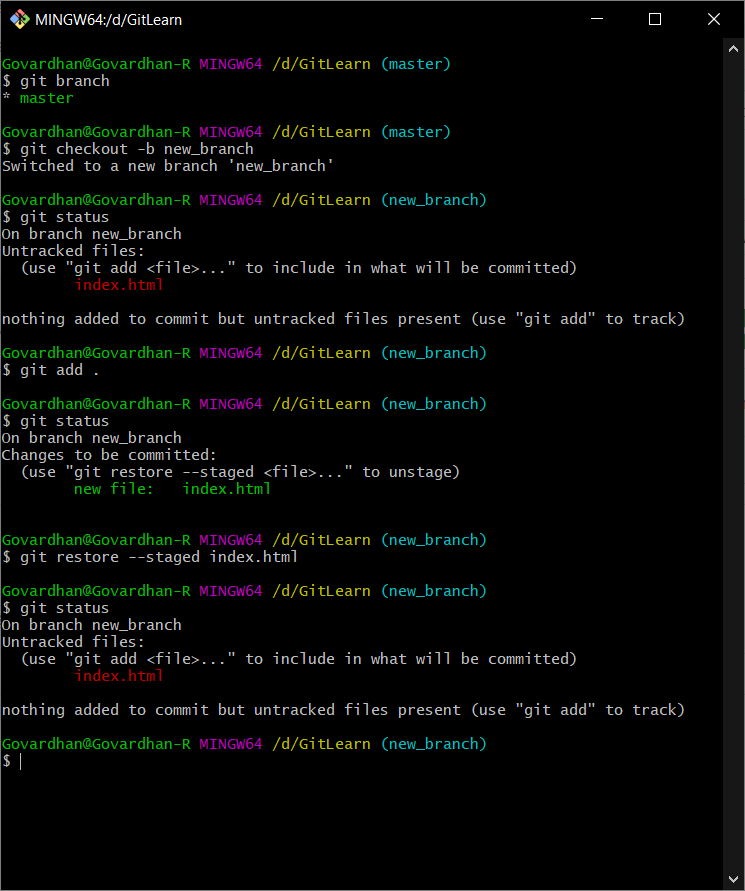

# Learn Git Here

### Scenario 1

  
Newly created files are untracked. If we `stage` them, they get tracked and staged. If we `restore --staged` these changes, the file goes back to untracked.

### Scenario 2

Local master is ahead of remote master by 2 commits. What happens when we do a `git pull`?
